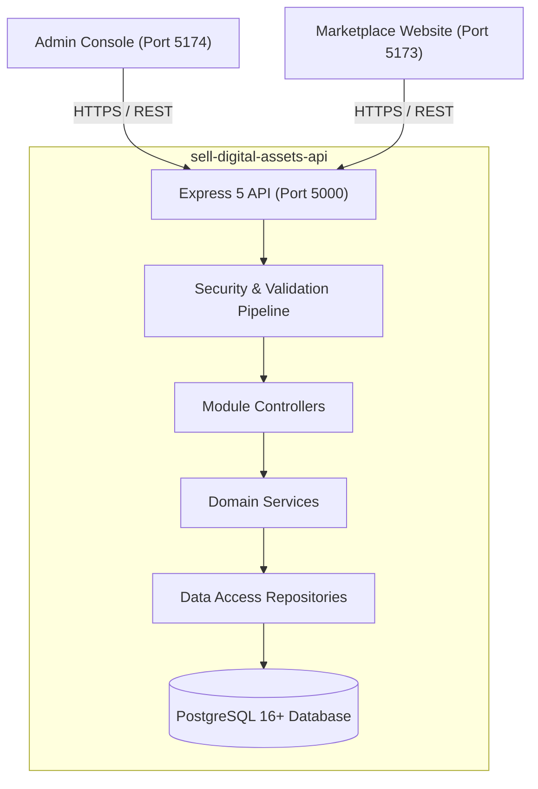
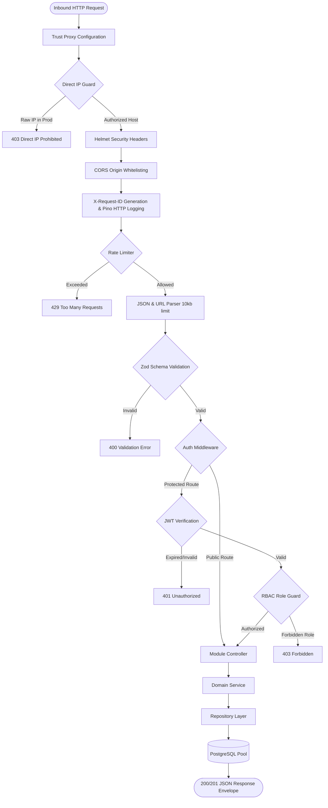

# Sell Digital Assets API — System Architecture & Technical Blueprint

> **System**: Core REST API, Persistence & Theming Engine for the Sell Digital Assets Ecosystem.  
> **Tech Stack**: Node.js 22+, Express 5, TypeScript (NodeNext ESM), PostgreSQL (`pg`), Zod 4, Helmet 8, Swagger UI, Pino.  
> **Deployment Target**: Render.com Web Service + Managed PostgreSQL.

---

## 1. Architectural Overview

The `sell-digital-assets-api` serves as the authoritative backend engine for both the client marketplace (`sell-digital-assets-website`) and the administration console (`sell-digital-assets-admin`). Engineered with **Domain-Driven Modular Design**, the codebase cleanly separates HTTP orchestration, business logic, data persistence, dynamic theme compilation, and security controls.



---

## 2. Request Execution Pipeline

Every inbound HTTP request strictly traverses an unbroken, defense-in-depth pipeline before reaching application business logic:



---

## 3. Directory & Module Structure

```text
sell-digital-assets-api/
├── public/                              # Static public assets (logo.png, favicon.ico, theme stylesheets)
├── src/
│   ├── config/
│   │   ├── env.ts                       # Validated environment configuration with fail-fast assertions
│   │   └── database.ts                  # PostgreSQL connection pool with IPv4 DNS priority & SSL
│   ├── core/
│   │   ├── errors/
│   │   │   ├── app-error.ts             # Operational AppError class (status, code, operational flag)
│   │   │   └── index.ts
│   │   ├── logger/                      # High-performance structured logging via Pino & pino-http
│   │   ├── middleware/
│   │   │   ├── auth.middleware.ts       # JWT verification & Bearer token extraction
│   │   │   ├── cors.middleware.ts       # Dynamic origin whitelisting (Admin, Website, Localhost)
│   │   │   ├── error.middleware.ts      # Centralized error translation & DB constraint sanitization
│   │   │   ├── ip-guard.middleware.ts   # Direct server IP address blocking in production
│   │   │   ├── rate-limit.middleware.ts # Tiered limiters (general: 100/15m, auth: 5/15m, download: 25/1h)
│   │   │   └── request-id.middleware.ts # Unique X-Request-ID tracking header
│   │   ├── security/
│   │   │   ├── password.ts              # Salted bcrypt password hashing (factor 12) & verification
│   │   │   ├── permissions.ts           # RBAC matrix (user, creator, admin) & permission guards
│   │   │   ├── signed-url.ts            # HMAC-SHA256 digital asset download token generator & validator
│   │   │   └── tokens.ts                # Dual JWT tokens (Access 15m, Refresh 7d)
│   │   └── validation/
│   │       └── validate.middleware.ts   # Express middleware for Zod schema validation
│   ├── data/                            # Default static datasets & seed configuration
│   │   ├── categories.ts                # Digital asset category hierarchy seeds
│   │   ├── currencies.ts                # Top global currencies & Unicode symbols
│   │   ├── organizations.ts             # Platform organization singleton seed
│   │   └── themes.ts                    # Preset theme palettes & design tokens
│   ├── database/
│   │   ├── repositories/
│   │   │   ├── base.repository.ts       # Abstract repository with query execution helpers
│   │   │   ├── categories.repository.ts # Category tree hierarchy, CRUD, soft-delete & restore
│   │   │   ├── organizations.repository.ts # Singleton organization configuration & currencies
│   │   │   ├── theme.repository.ts      # Theme palettes, active theme selection & CSS compilation
│   │   │   └── user.repository.ts       # User account persistence & credential verification
│   │   └── reset.ts                     # Full automated schema builder, trigger installer, and seed runner
│   ├── modules/
│   │   ├── auth/                        # Registration, login, token refresh, and logout
│   │   ├── categories/                  # Hierarchical taxonomy tree, CRUD, soft-delete & restore
│   │   ├── organizations/               # Singleton organization profile, branding, and currencies
│   │   ├── theme/                       # Active theme selection, palette updates & dynamic CSS
│   │   └── users/                       # User profile management, directory pagination & role governance
│   ├── pages/                           # Dynamic SSR status dashboard and server health UI
│   ├── swagger/                         # OpenAPI 3.0 documentation configuration & generator
│   ├── app.ts                           # Express application factory & middleware stack
│   └── server.ts                        # HTTP server listener, database probe, and graceful shutdown
├── package.json
├── tsconfig.json
└── README.md
```

---

## 4. Database Architecture & Schema Models

### Relational Entity-Relationship Diagram

```mermaid
erDiagram
    CURRENCIES {
        varchar(3) code PK
        varchar(100) name
        varchar(10) symbol
        timestamptz created_at
    }

    ORGANIZATIONS {
        smallint id PK "Checked id = 1 (Singleton)"
        varchar(150) organization_name
        varchar(150) legal_name
        varchar(255) tagline
        text description
        text logo_url
        text logo_dark_url
        text favicon_url
        text cover_banner_url
        citext support_email
        citext contact_email
        varchar(50) support_phone
        text support_url
        varchar(255) address_line1
        varchar(255) address_line2
        varchar(100) city
        varchar(100) state
        varchar(20) postal_code
        varchar(100) country
        varchar(50) tax_id
        varchar(3) default_currency FK
        numeric(5,2) platform_fee_percent
        numeric(10,2) payout_minimum
        jsonb social_links
        jsonb metadata
        timestamptz created_at
        timestamptz updated_at
    }

    ROLES {
        varchar(50) name PK
        text description
        timestamptz created_at
    }

    USERS {
        uuid id PK
        citext email UK
        varchar(255) password_hash
        varchar(255) name
        varchar(50) role FK
        boolean is_active
        jsonb metadata
        timestamptz created_at
        timestamptz updated_at
    }

    CATEGORIES {
        serial id PK
        integer parent_id FK
        varchar(100) name
        varchar(120) slug UK
        integer depth
        text path
        integer display_order
        boolean is_active
        jsonb metadata
        timestamptz created_at
        timestamptz updated_at
    }

    THEMES {
        serial id PK
        varchar(100) name
        varchar(100) slug UK
        varchar(20) mode
        boolean is_active
        jsonb color_hex_map
        jsonb color_tokens
        jsonb typography
        varchar(50) border_radius
        jsonb metadata
        timestamptz created_at
        timestamptz updated_at
    }

    CURRENCIES ||--o{ ORGANIZATIONS : "default currency"
    ROLES ||--o{ USERS : "assigned to"
    CATEGORIES ||--o{ CATEGORIES : "parent of"
```

---

## 5. Security & Cryptographic Architecture

1. **Direct IP Access Defense**:
   - In production, `ipGuardMiddleware` inspects host headers and immediately drops raw IPv4 or IPv6 requests (HTTP 403), protecting the server against automated scans.
2. **PostgreSQL Truncation & Deletion Defense**:
   - The `organizations` configuration is protected against table truncation by the `prevent_table_truncate()` trigger and against row deletion by the `no_delete_organizations` rule.
3. **Password Security**:
   - Passwords are salt-hashed using `bcryptjs` with 12 rounds. Hashes are excluded by default in repository projections.
4. **Rate Limiting Tiers**:
   - **General API**: 100 requests per 15 minutes per IP.
   - **Auth Brute-Force Defense**: 5 failed attempts per 15 minutes per IP (`skipSuccessfulRequests: true`).
   - **Asset Download Scraper Defense**: 25 downloads per 1 hour per IP.
5. **Digital Asset Protection**:
   - HMAC-SHA256 time-limited signed tokens verified with constant-time equality checks (`crypto.timingSafeEqual`) to eliminate timing attacks.

---

## 6. Operational & Build Runbook

```powershell
# Development server with hot-reload
npm run dev

# Regenerate Swagger OpenAPI documentation
npm run swagger

# Strict TypeScript type check
npx tsc --noEmit

# Clean reset database schema and run seeds
npm run db:reset

# Production build
npm run build

# Start production server
npm start
```
