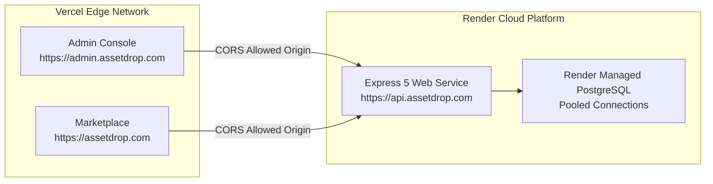

# Sell Digital Assets — Platform Ecosystem Architecture Guide

> **Ecosystem**: Sell Digital Assets / AssetDrop Multi-Portal Platform  
> **Repositories**:  
> 1. `sell-digital-assets-api` (Backend REST API & Database Engine — Port 5000)  
> 2. `sell-digital-assets-website` (Client Marketplace & Creator Studio — Port 5173)  
> 3. `sell-digital-assets-admin` (Operational Admin Console — Port 5174)

---

## 1. System Ecosystem Topology

The platform consists of three decoupled repositories operating against a unified PostgreSQL database and shared design tokens:

```mermaid
graph TB
    subgraph "Clients Layer (Vercel Edge CDN)"
        WebClient["sell-digital-assets-website<br/>(React 19 + TanStack Query)<br/>Port: 5173"]
        AdminClient["sell-digital-assets-admin<br/>(React 19 + In-Memory SWR)<br/>Port: 5174"]
    end

    subgraph "Backend Engine (Render Web Service)"
        API["sell-digital-assets-api<br/>(Node.js + Express 5 + TypeScript ESM)<br/>Port: 5000"]
    end

    subgraph "Persistence Layer (Render Managed Database)"
        PG[("PostgreSQL 16+<br/>citext, pgcrypto, tables:<br/>currencies, organizations, users, products, inventory, sales")]
    end

    WebClient -->|Public Catalog, Cart, Checkout, Downloads| API
    AdminClient -->|Organization Settings, Metrics, Users Directory| API
    API -->|Connection Pool (pg)| PG
```

---

## 2. Port Allocation & Local Development Matrix

| Service | Technology | Local Port | Default URL | Environment Role |
| :--- | :--- | :--- | :--- | :--- |
| **API** | Express 5 / Node.js 22 | `5000` | `http://localhost:5000` | Backend REST engine, database driver, token mint |
| **Website** | React 19 / Vite 8 | `5173` | `http://localhost:5173` | Public marketplace, checkout, buyer/creator portal |
| **Admin** | React 19 / Vite 8 | `5174` | `http://localhost:5174` | Superadmin console, branding governance, user management |

---

## 3. Cross-Repository Data Contracts & Flows

### A. Authentication & Role Segregation
* **Unified JWT Standard**: Both frontends consume JWT tokens minted by `sell-digital-assets-api` (`POST /api/auth/login`).
* **Roles**:
  * `admin`: Permitted to authenticate against `sell-digital-assets-admin` and manage system configuration.
  * `creator`: Permitted on `sell-digital-assets-website` to upload digital goods, manage pricing tiers, and inspect sales metrics.
  * `user` (Buyer): Permitted on `sell-digital-assets-website` to purchase assets, access their purchase library, and download asset files.

### B. Organization Configuration & Currency Synchronization
* The `organizations` singleton table in PostgreSQL stores legal name, branding, tagline, default currency, and minimum payout threshold.
* The `currencies` table stores supported global currencies (`PKR`, `USD`, `EUR`, `GBP`, etc.) with their unicode symbols (`₨`, `$`, `€`, `£`, `¥`).
* When an administrator alters the organization currency in `sell-digital-assets-admin`, the change propagates across the backend REST endpoints and dynamically updates prices and payouts across `sell-digital-assets-website`.

### C. Digital Asset Fulfillment Pipeline
1. **Asset Upload**: Creator uploads file bundle via `sell-digital-assets-website` (`POST /api/inventory`).
2. **Catalog Publication**: Asset listed on marketplace (`GET /api/products`).
3. **Checkout & Purchase**: Buyer purchases asset via `POST /api/sales/checkout`.
4. **Cryptographic Link Minting**: Backend mints time-limited (15-min) HMAC-SHA256 signed download link (`POST /api/sales/generate-download-link`).
5. **Secure Delivery**: Binary streamed with tamper detection via `GET /api/sales/download?token=...`.

---

## 4. Local Development Orchestration Runbook

To run all three applications simultaneously on a development workstation:

### Terminal 1: Backend API
```powershell
cd c:\GH\sell-digital-assets-api
npm install
npm run dev
# Server listens on http://localhost:5000
```

### Terminal 2: Marketplace Website
```powershell
cd c:\GH\sell-digital-assets-website
npm install
npm run dev
# Vite runs on http://localhost:5173
```

### Terminal 3: Admin Console
```powershell
cd c:\GH\sell-digital-assets-admin
npm install
npm run dev
# Vite runs on http://localhost:5174
```

### Database Initialization / Reset
If initializing a fresh environment or reseeding the database:
```powershell
cd c:\GH\sell-digital-assets-api
npm run db:reset
```

---

## 5. Production Deployment Topology



* **Backend CORS Configuration**: `ALLOWED_ORIGINS` in `sell-digital-assets-api/.env` must contain both production domains:
  ```env
  ALLOWED_ORIGINS=https://assetdrop.com,https://admin.assetdrop.com,http://localhost:5173,http://localhost:5174
  ```

